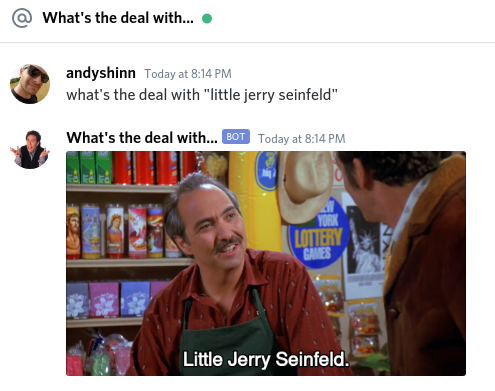

# Universal Seinfeld Bus



USB is an intentionally ambiguous acronym that describes multiple software ideas related to the hit television series "Seinfeld".

* Universal Seinfeld Bus: A USB (Universal Serial Bus) drive that can boot and play TV episodes on a PC.
* Universal Seinfeld Bibliography: A web API for querying a quote database and returning images and data about the quote.
* Universal Seinfeld Binary: A command line utility that can query the API and perform other tasks (protyped at https://github.com/progrium/usb).
* Universal Seinfeld Bot: A bot that can live in chat software (such as Discord or Slack) and respond to commands to query the API.

The only working piece at the moment is a Discord bot. You can join the Seinfeld Discord server at https://discord.gg/6z23uzH to play with it (try sending *what's the deal with "no soup for you"* in the *#whats-the-deal-with* channel).

## Local Development

Requirements:

* Kubernetes (we use [k3s](https://k3s.io/) in this example)
* [Skaffold](https://skaffold.dev/)
* [Kustomize](https://kustomize.io/) (as standalone binary for Skaffold)
* A Docker registry (GCR used in our example)

Install k3s:

```
sudo apt install git docker.io
sudo usermod -a -G $USER docker
curl -sfL https://get.k3s.io | K3S_KUBECONFIG_MODE="644" sh -s -
# reload shell because Linux groups
ln -s /etc/rancher/k3s/k3s.yaml ~/.kube/config
sudo chmod 777 /var/usb/es
```

Setup your image pull secret. Following example for GCR:

```
# create a GCP service account; format of account is email address
SA_EMAIL=$(gcloud iam service-accounts --format='value(email)' create k8s-gcr-auth-ro)

# create the json key file and associate it with the service account
gcloud iam service-accounts keys create k8s-gcr-auth-ro.json --iam-account=$SA_EMAIL

# get the project id
PROJECT=$(gcloud config list core/project --format='value(core.project)')

# add the IAM policy binding for the defined project and service account
gcloud projects add-iam-policy-binding $PROJECT --member serviceAccount:$SA_EMAIL --role roles/storage.objectViewer

SECRETNAME="usb-gcr"

kubectl create secret docker-registry "$SECRETNAME" \
  --docker-server=https://gcr.io \
  --docker-username=_json_key \
  --docker-email="$SA_EMAIL" \
  --docker-password="$(cat k8s-gcr-auth-ro.json)"

kubectl patch serviceaccount default \
  -p "{\"imagePullSecrets\": [{\"name\": \"$SA_EMAIL\"}]}"
```

Start services with Skaffold. Replace `<myrepo>` with your repository:

```
skaffold config set default-repo <myrepo>
skaffold dev -p local
```

Now we need to grab the Appsearch secret:

 * Visit http://appsearch-127-0-0-1.nip.io/as#/onboarding
 * Add `seinfeld` engine (Universal or English locale)
 * Skip rest of the onboarding
 * Navigate to the _Credentials_ section and copy private key to clipboard
 * Create the secrets usingcommands below:

```
kubectl create secret generic appsearch --from-literal=private_key=<pasted_key>
kubectl create secret generic sentry --from-literal=dsn=<sentry_dsn>
kubectl create secret generic discord-bot-token --from-literal=DISCORD_TOKEN=<discord_bot_token>
```

Visit the services:

* Appsearch: http://appsearch-127-0-0-1.nip.io
* Web: http://web-127-0-0-1.nip.io/search/seinfeld/yada
* Flower: http://flower-127-0-0-1.nip.io

## Indexing Videos

```
kubectl exec -it local-usb-64d4b66db8-jzsbd --container worker -- usb cli.index-subs "/videos/Seinfeld/**/*.mkv"
```
